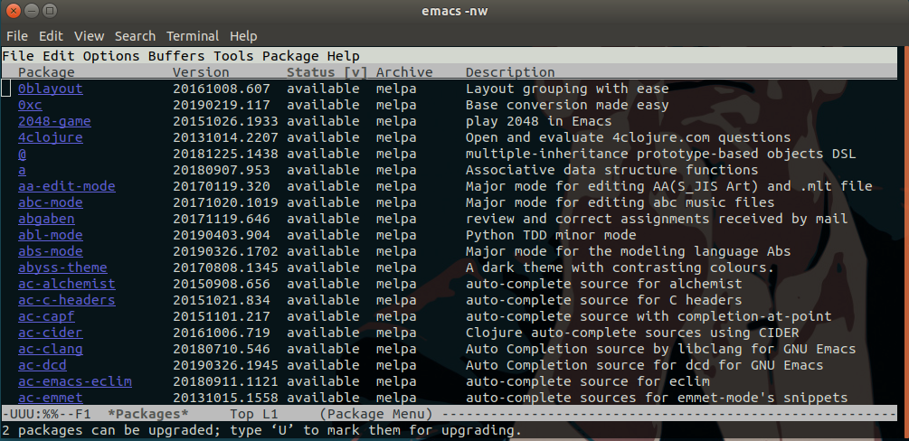

# emacs扩展

## 关于emacs扩展
有人说emacs可以做所有的事情，扩听音乐，写博客，编程等等，煮咖啡这种事情就不用说了。　　
有人说emacs是一个伪装成编辑器的操作系统，这些说法在我看来都毫不夸张，因为它的确可以做到，just:

```bash
emacs -nw
```

那么emacs怎样成为做任何事情,那就需要我们添加扩展


## 1.添加melpa扩展源
在添加emacs扩展前，要先配置emacs添加[melpa扩展源](https://github.com/melpa/melpa)

### 1.1 打开emacs配置

```bash
emacs ~/.emacs
```

### 1.2 添加一下配置

```lisp
;;config package                                                                
(require 'package) ;; You might already have this line                          
(add-to-list 'package-archives
             '("melpa" . "https://melpa.org/packages/"))
(when (< emacs-major-version 24)
  ;; For important compatibility libraries like cl-lib                          
  (add-to-list 'package-archives '("gnu" . "http://elpa.gnu.org/packages/")))
(package-initialize) ;; You might already have this line 
```

## 添加配置扩展的流程

配置好melpa扩展源后一般按照一下步骤安装emacs扩展（在emacs窗口中操作）

- 1.`M-x list-packages`（按住`Alt`+字母`x`，然后输入`list-packages`，后按回车），可以列出所有可以安装的扩展库



- 如果想退出就只需要按一下键盘`q`

- 2.`M-x package-install`（按住`Alt`+字母`x`，然后输入`package-install`，后按回车），进入package安装模式
- 3.输入安装的扩展名称


然后输入对应要安装的package名称,如安装auto-complete
```
Install package: auto-complete
```

最后在配置文件中添加

```lisp
;;Auto complete                                                                 
(require 'auto-complete-config)
(add-to-list 'ac-dictionary-directories "词典的目录")
;;词典的目录系统不同,Ubuntu的在~/.emacs.d/elpa/auto-complete-*/dict

```


## 添加自动补全auto-complete


—End—

## 迭代


* 2017年2月22日 23:02 初稿


