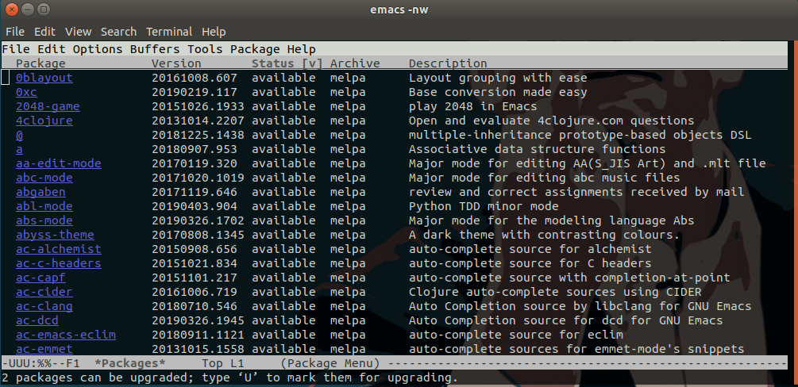
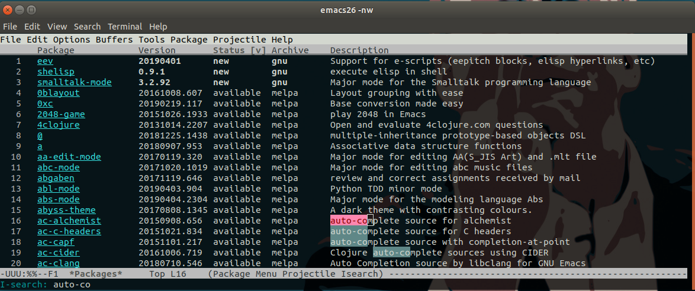
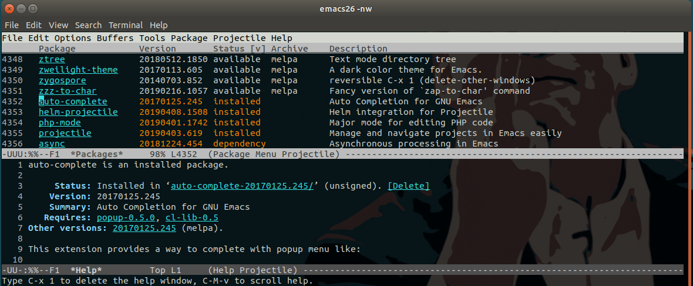
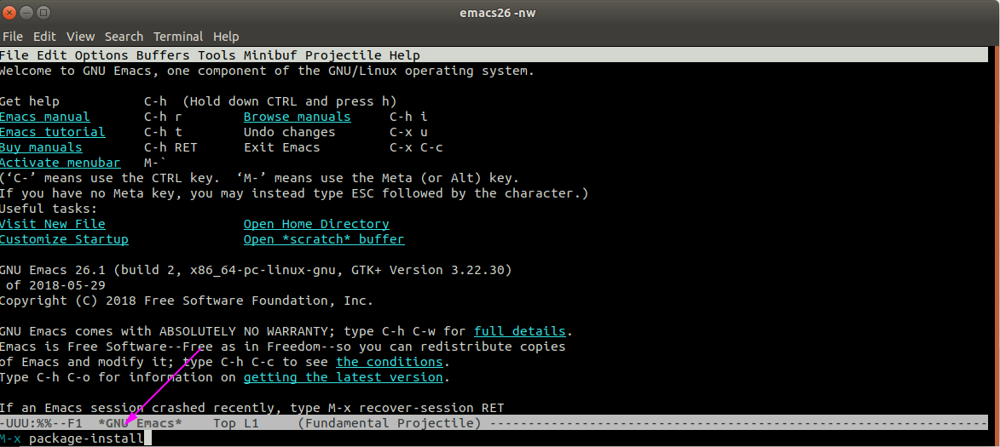
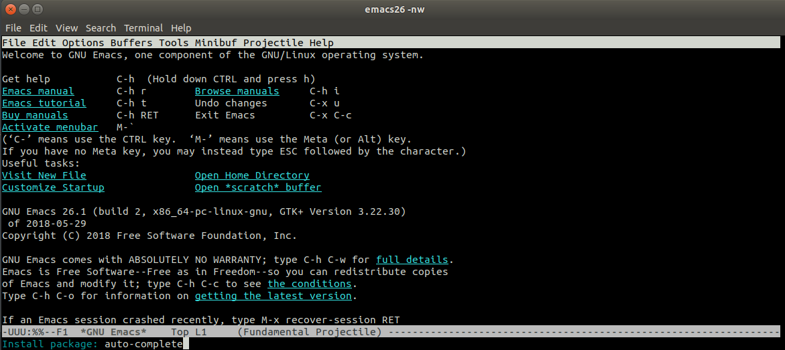
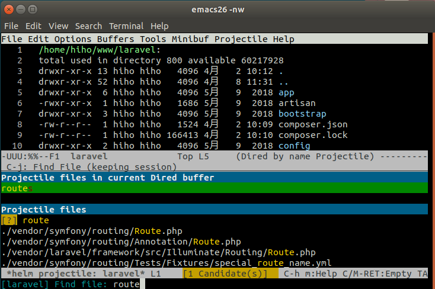
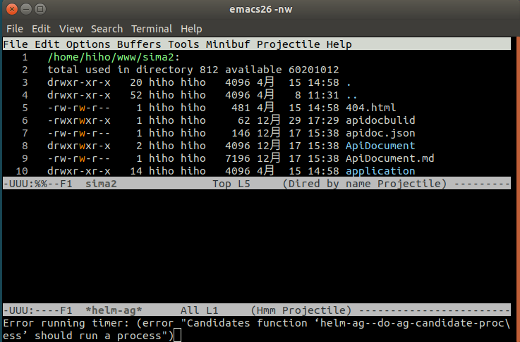
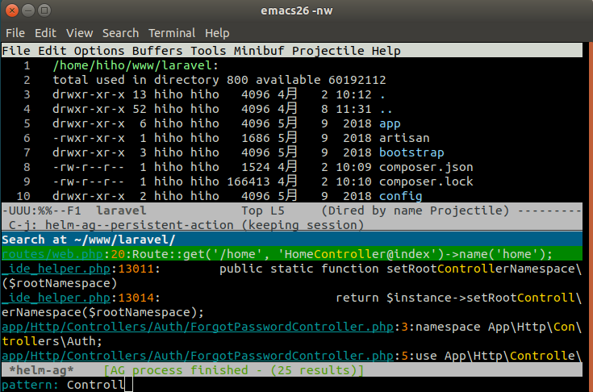

# emacs扩展

## 关于emacs扩展

有人说emacs可以做所有的事情，扩听音乐，写博客，编程等等，煮咖啡这种事情就不用说了。  
有人说emacs是一个伪装成编辑器的操作系统，这些说法在我看来都毫不夸张，因为它的确可以做到，just:

```bash
emacs -nw
```

那么emacs怎样成为做任何事情,那就需要我们添加扩展


## 1.添加melpa扩展源
在添加emacs扩展前，要先配置emacs添加[melpa扩展源](https://github.com/melpa/melpa)

### 1.1 打开emacs配置

```bash
emacs ~/.emacs
```

### 1.2 添加一下配置

```lisp
;;config package                                                                
(require 'package) ;; You might already have this line                          
(add-to-list 'package-archives
             '("melpa" . "https://melpa.org/packages/"))
(when (< emacs-major-version 24)
  ;; For important compatibility libraries like cl-lib                          
  (add-to-list 'package-archives '("gnu" . "http://elpa.gnu.org/packages/")))
(package-initialize) ;; You might already have this line 
```

保存并退出

```bash
C-x C-s
C-x C-c
```


## 插件包管理

1.查看插件包列表  

配置好melpa插件源后一般按照一下步骤安装emacs插件（在emacs窗口中操作）

`M-x list-packages　RET`（按住`Alt`+字母`x`，然后输入`list-packages`，后按`Enter`键），可以列出所有可以安装的插件库



2.按`q`退出  

到这里了，很多人不知道怎么退回到`list-packages`之前，有木有～，包括作者一开始也一顿操作`Esc`,`Ctrl c`都没办法退出，
如果想退出就只需要按一下键盘`q`

3.搜索  

搜索可以看[3.基本操作的搜索操作](3.基本操作.md#搜索)



4.查看包信息  

当光标移动到对应的Package时候，可以按`Enter`键查看package的详细信息


按`C-x 1`（按住`Ctrl`+字母`x`，然后输入`1`）可以关闭详细信息窗口。


## 安装插件


- 安装方法1
    - 1.`M-x package-install`（按住`Alt`+字母`x`，然后输入`package-install`，后按回车），进入package安装模式
    
    - 2.输入安装的插件名称，按回车
    
    - 3.待安装完成后，再到配置文件(~/.emacs)中修改对应的配置
- 安装方法2
    - 1.`M-x list-package`打开插件包列表
    - 2.在插件包列表窗口,先标记操作(`i`,`d`,`u`)，然后按`x`键
        - •【Enter ↵】 显示包相关帮助
        - •【i】 标记为要安装
        - •【u】 取消安装或卸载标记
        - •【d】 标记为要卸载
        - •【x】 执行安装或卸载
        - •【r】 刷新列表
        - •【f】 输入关键字过滤列表，按q恢复完整列表
    - 3.待安装完成后，再到配置文件(~/.emacs)中修改对应的配置


## 添加evil插件

evil插件是一个然emacs操作切换成vim的插件，让用emacs用起来和vim一样，但是本人并不提倡使用该插件，还不如直接用vim

### 安装
`M-x package-install`，然后输入`evil`回车


### 配置
修改配文件`~/.emacs`，添加：

```bash
(require 'evil)
(evil-mode 1)
```

### 使用

在emacs窗口中按`C-z`可以在emacs操作模式和vim操作模式中切换


## helm-projectile

[helm-projectile](https://github.com/bbatsov/helm-projectile)是projectile的衍生项目，用于管理一个项目，提供`快速查找文件`等功能



### 安装
`M-x package-install`，然后输入`helm-projectile`回车


### 配置
修改配文件`~/.emacs`，添加：

```lisp
(projectile-global-mode)
  
(require 'helm-projectile)
(helm-projectile-on)
  
(defun h-find-file()
  (interactive)
  (helm-projectile-find-file)
)
(define-key global-map (kbd "C-x C-p") 'h-find-file)

```

### 使用

使用emacs的`C-x C-f`进入项目目录或打开某个文件，然后按`C-x C-p`即可以进行文件搜索


### 文件内容搜索helm-projectile-ag


修改配文件`~/.emacs`，添加：

```lisp
(defun helm-ag-file()
   (interactive)
   (helm-projectile-ag)
)
 
(define-key global-map (kbd "C-x C-a") 'helm-ag-file)
```

使用`C-x C-a`可以进行项目文件内容搜索

### 错误，在使用`helm-projectile-ag`是发现报错：

```bash
Error running timer: (error "Candidates function ‘helm-ag--do-ag-candidate-process’ should run a process")
```




原来是这个组件搜索依赖系统上的ag


参考

- https://emacs-china.org/t/ag-helm-ag/640
- https://www.jianshu.com/p/0b63f368f5ff


```bash
sudo apt install silversearcher_ag
```

修复好后：




## 安装auto-complete插件

然后输入对应要安装的package名称,如安装auto-complete
```
Install package: auto-complete
```

最后在配置文件中添加

```lisp
;;Auto complete                                                                 
(require 'auto-complete-config)
(add-to-list 'ac-dictionary-directories "词典的目录")
;;词典的目录系统不同,Ubuntu的在~/.emacs.d/elpa/auto-complete-*/dict

```


## 添加自动补全auto-complete


—End—

## 迭代


* 2017年2月22日 23:02 初稿


